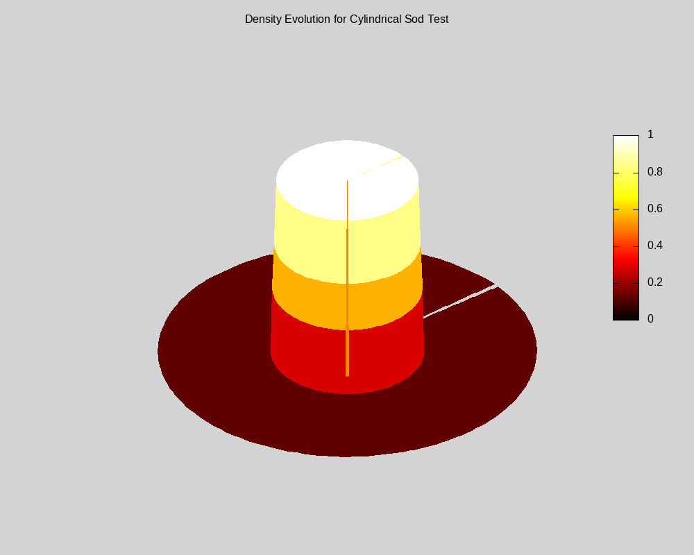
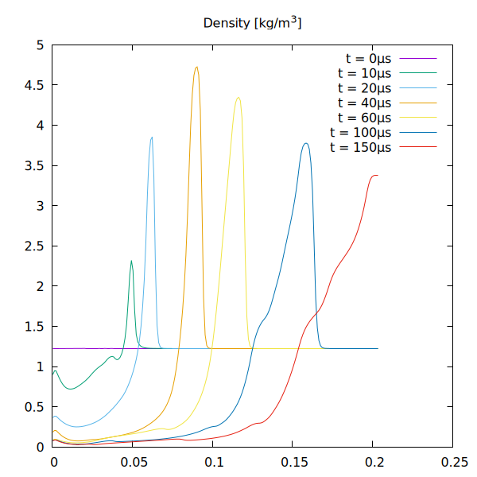
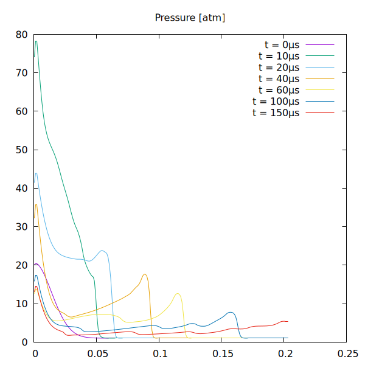
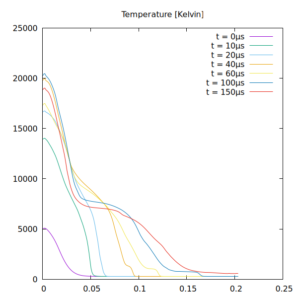

# Lightning Simulation in C++
Using magnetohydrodynamics with a cylindrical coordinate system to model lightning.

## Cylindrical Compressible Euler equations
Converted 1d Slope Limiting scheme (SLIC) into axi-symmetric cylindrical coordinates using source terms.

  

<em>Figure 1: Density over Time under Cylindrical Sod Shock Test</em>

## Working Lighting Model (Tabulated Equation of State)
Finite difference and finite volume schemes modelling lightning strike.
- Electromagnetic source terms with subcycling.
- Lighting modelled as a cylindrically symmetric rod.
- Bilinear interpolation on a tabulated equation of state.
- Reflective Boundaries (representing the line of symmetry at r=0) at LHS of mesh and transmissive boundaries (representing the artificial open boundary with air) on RHS of mesh.
  

  
  
  

