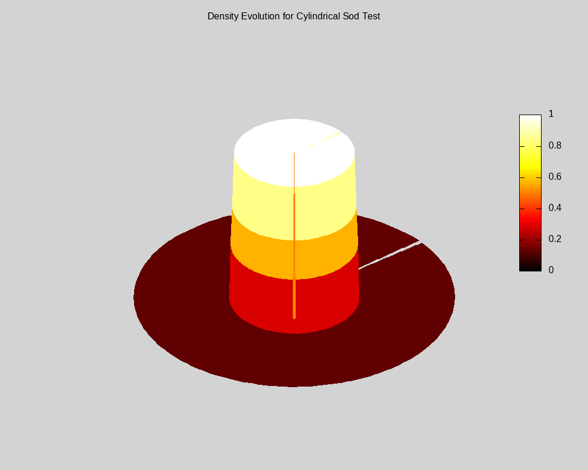

# Lightning Simulation in C++
Using magnetohydrodynamics and a cylindrical coordinate system to model lightning.

## Cylindrical Compressible Euler equations
Converted 1d Slope Limiting scheme (SLIC) into axi-symmetric cylindrical coordinates using source terms.

  

<em>Figure 1: Density over Time under Cylindrical Sod Shock Test</em>

